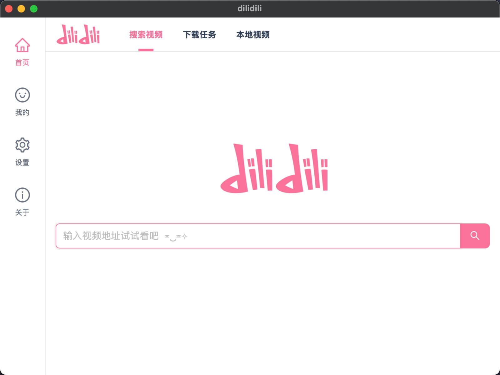
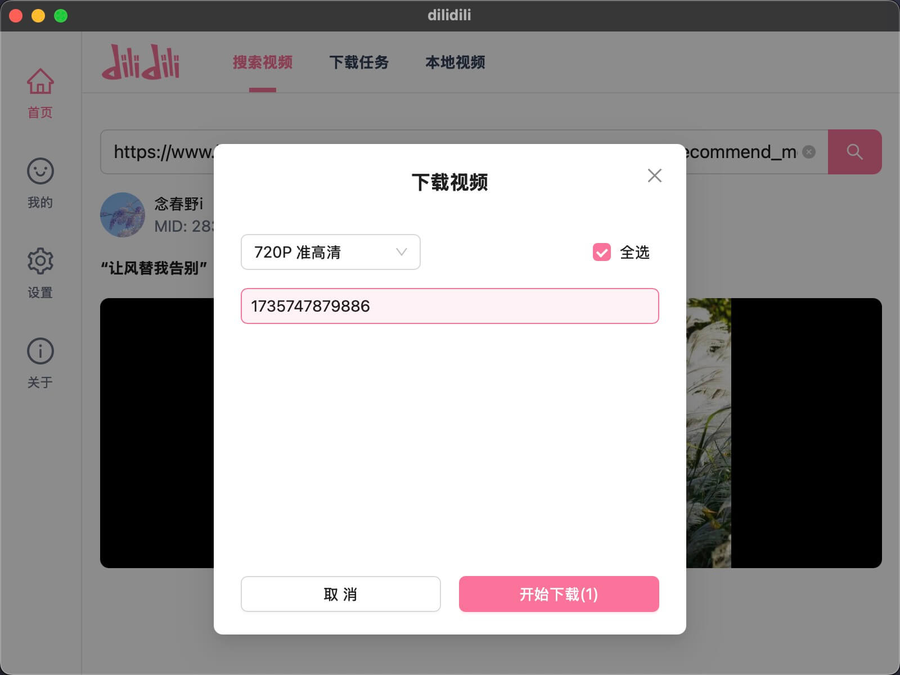

# dilidili 重构

一个用于下载和管理 bilibili bv 视频的桌面应用

## 预览






## deps

- vitejs
- react-router@7
- tailwindcss
- antd-ui
- jotai
- react-query
- eslint@9
- react-dev-inspector

## dev

```bash
pnpm dev
```

## bilibili-api

感谢[bilibili-API-collect](https://github.com/SocialSisterYi/bilibili-API-collect/tree/master)开源项目

## 项目构建

先使用 vite 创建项目, 或者其他的模版项目; 然后根据[官方文档](https://v2.tauri.app/start/create-project/#manual-setup-tauri-cli)额外安装 tauri@v2

### sidecar 模式使用 ffmpeg

> [参考文档 Embedding External Binaries](https://v2.tauri.app/develop/sidecar/)

1. 安装 [shell 插件](https://v2.tauri.app/plugin/shell/)
2. 配置`src-tauri/tauri.conf.json`
   ```json
   { "bundle": { "externalBin": ["binaries/ffmpeg"] } }
   ```
3. 配置 shell 的执行权限 `src-tauri/capabilities/default.json`

   ```json
   {
     "permissions": [
       {
         "identifier": "shell:allow-execute",
         "allow": [
           {
             "name": "binaries/ffmpeg",
             "sidecar": true, // sidecar 模式
             "args": true // 允许 ffmpeg 输入参数(居然不是默认允许的,草弹)
           }
         ]
       }
     ]
   }
   ```

4. 根据 `ffmpeg-bins/copy-ffmpeg.mjs` 中所述, 准备 ffmpeg 可执行文件

### http 请求

1. 安装 [http](https://v2.tauri.app/plugin/http-client/) 插件
2. 配置 `src-tauri/Cargo.toml`
   ```yml
   tauri-plugin-http = { version = "2", features = ["unsafe-headers"] }
   ```
3. 参考`src/core/request.ts`中的`getCORSHeaders`, 使请求允许跨域
4. 配置权限 `src-tauri/capabilities/default.json`
   ```json
   {
     "permissions": [
       {
         "identifier": "http:default",
         "allow": [{ "url": "https://api.bilibili.com/*" }] // 可以使用通配符, 允许所有域名
       }
     ]
   }
   ```

### 访问本地图片

> 参考文档
> [convertfilesrc](https://v2.tauri.app/reference/javascript/api/namespacecore/#convertfilesrc) , [csp](https://v2.tauri.app/security/csp/)

配置

```json
{
  "app": {
    "security": {
      "csp": {
        "default-src": "'self' customprotocol: asset:",
        "connect-src": "ipc: http://ipc.localhost",
        "img-src": "'self' asset: http://asset.localhost blob: data:",
        "style-src": "'unsafe-inline' 'self'"
      },
      "assetProtocol": {
        "enable": true,
        "scope": ["**/*"] // 由于本 app 的资源文件夹是任意配置的, 因此不限制访问路径
      }
    }
  }
}
```

### 生成图标

1. 在项目根目录（package.json 所在目录）添加 `app-icon.png` 图标文件. 大小为 512x512
2. 执行 `pnpm tauri icon` 生成所有平台所需的图标文件

## debug 调试

打包时添加`--debug`参数可以在打包后的应用中使用调试工具

```bash
pnpm tauri build --debug
```

另外可以在`src-tauri/Cargo.toml`配置中添加`devtools`默认开启调试模式

`tauri = { version = "2.2.4", features = ["protocol-asset",  "devtools"] }`

## release

执行以下脚本, 用于创建 tag 和推送代码

```bash
release-version.sh
```

在 github 仓库中运行 github action, 用于构建和发布应用; 在 release 页面可看到最新版本的草稿, 需手动发布
