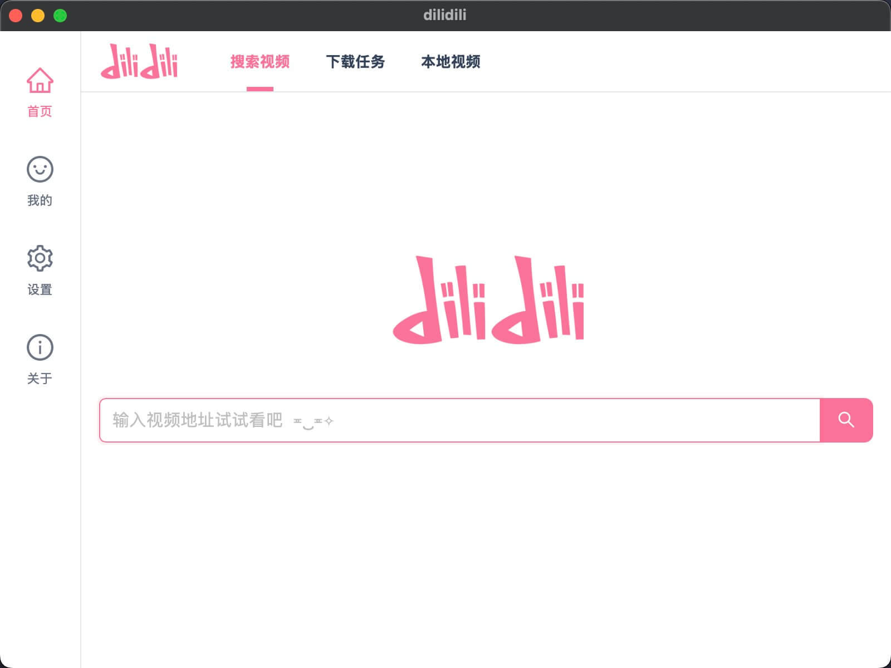
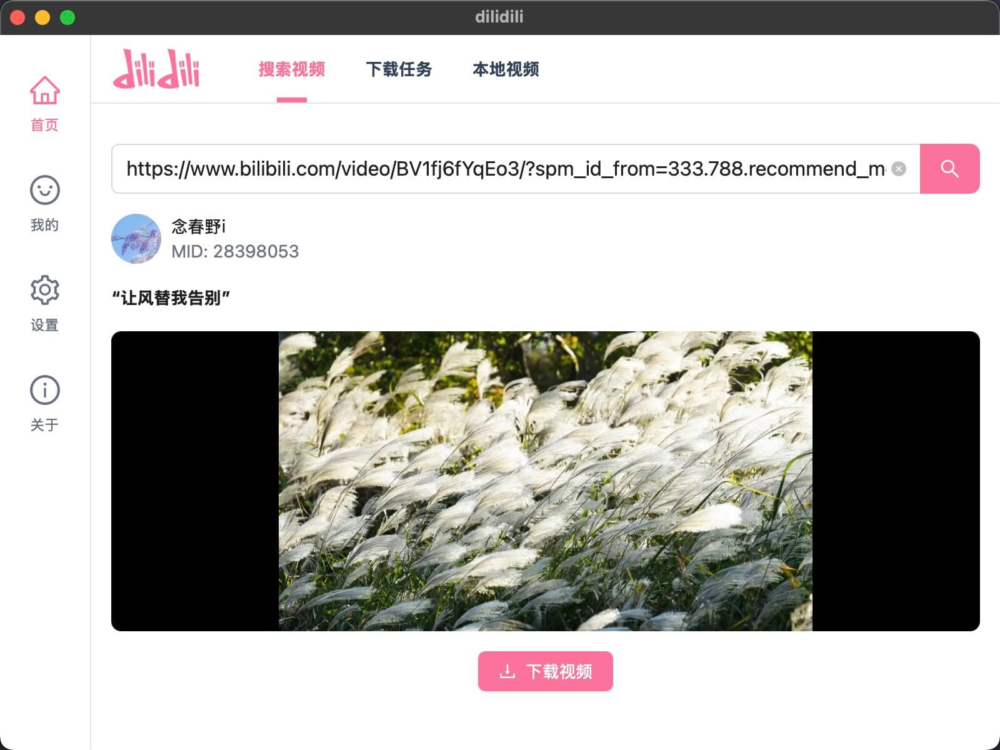
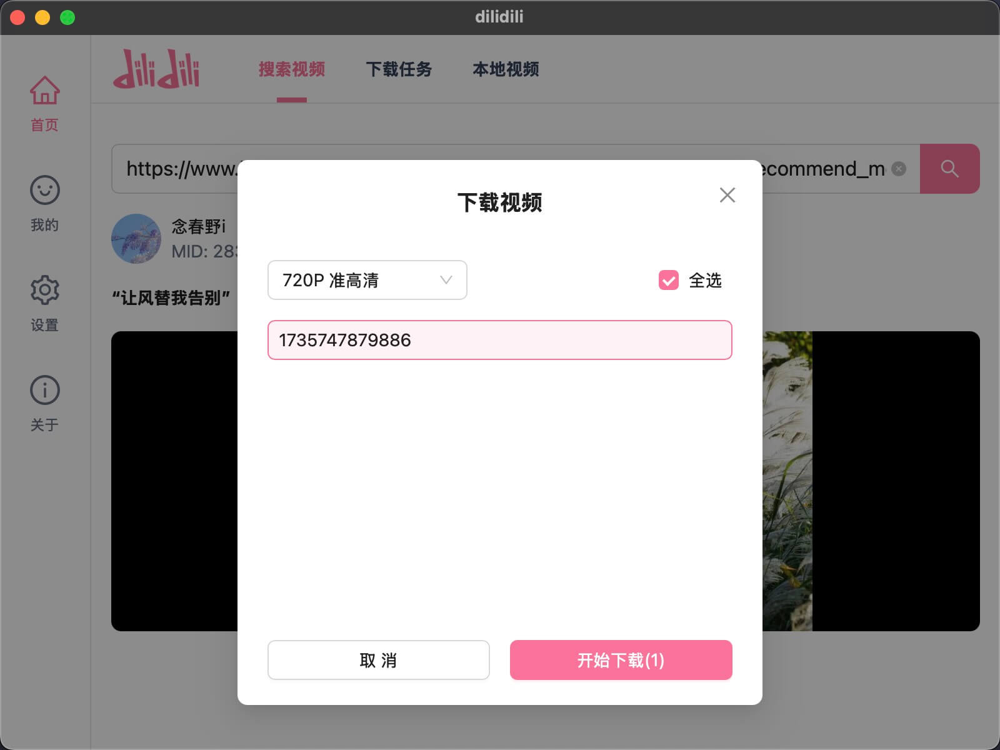
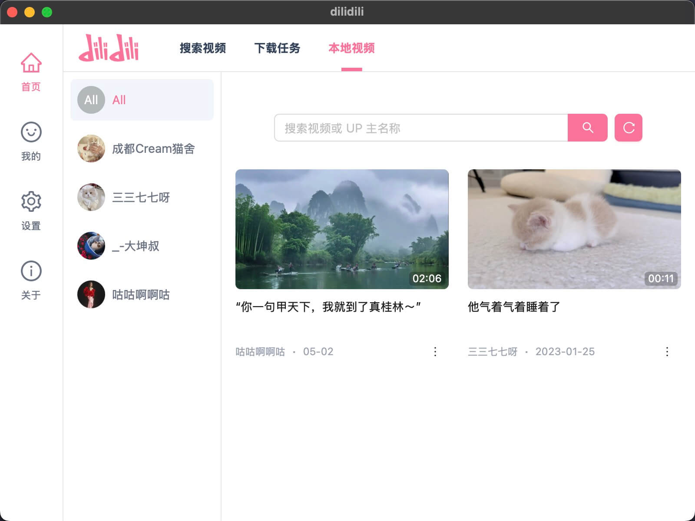

# dilidili 重构

一个用于下载和管理 bilibili bv 视频的桌面应用

## 预览







## deps

- vitejs
- react-router@7
- tailwindcss
- antd-ui
- jotai
- react-query
- eslint@9
- react-dev-inspector

## dev

```bash
pnpm dev
```

## bilibili-api

> bilibili 的接口都是非公开接口, 随时可能变更, 这里只记录项目实际用到的部分

感谢 [bilibili-API-collect](https://github.com/SocialSisterYi/bilibili-API-collect) 开源项目;
该仓库已于 2026 年 1 月停止维护并归档, 需要查资料可以参考 [BACNext](https://github.com/BACNext/BACNext)

### 扫码登录

> 2026 年 8 月起 bilibili 改版了 web 端扫码登录: 申请二维码和轮询的接口没变, 但登录成功后不再把 `SESSDATA` 拼在返回的链接上, 而是改为通过 `Set-Cookie` 下发

**1. 申请二维码**

```bash
GET https://passport.bilibili.com/x/passport-login/web/qrcode/generate?source=main-fe-header&go_url=<当前页面地址>
```

- `source` 是来源标识, 会回写到二维码链接的 `from` 参数
- `go_url` 是当前页面地址

```json
{
  "code": 0,
  "message": "OK",
  "data": {
    "url": "https://account.bilibili.com/h5/account-h5/auth/scan-web?navhide=1&callback=close&qrcode_key=xxx&from=main-fe-header",
    "qrcode_key": "xxx"
  }
}
```

把 `data.url` 渲染成二维码等待扫码即可; `data.qrcode_key` 是 32 位秘钥, 有效期 180 秒

**2. 轮询扫码状态**

```bash
GET https://passport.bilibili.com/x/passport-login/web/qrcode/poll?qrcode_key=<秘钥>&source=main-fe-header
```

每 2 秒请求一次, 以 `data.code` 判断状态

- `0` 登录成功
- `86101` 未扫码
- `86090` 已扫码未确认
- `86038` 二维码已失效, 需要重新申请

**3. 取登录凭证**

`data.code` 为 `0` 时, `data.url` 是跨域票据链接

```text
https://passport.biligame.com/x/passport-login/web/crossDomain?ticket=xxx
```

真正的 `SESSDATA` / `bili_jct` / `DedeUserID` 是通过 `Set-Cookie` 下发的, 按顺序尝试这两个来源

1. 轮询响应自身的 `Set-Cookie`
2. 带浏览器 UA 手动跟随一次 `data.url`, 从它的 `Set-Cookie` 里取

注意第 2 种不能自动重定向, 否则 302 之后的响应里就看不到 `Set-Cookie` 了

**踩过的坑**

- 浏览器的 `fetch` 读不到 `Set-Cookie`; 这里用的是 tauri 的 http 插件(底层是 reqwest), 响应头会原样透传给前端
- `Headers` 会把多个 `Set-Cookie` 合并成以 `, ` 拼接的字符串, 而 `Expires` 里本身就带逗号, 拆分时只能按 "逗号 + `key=`" 的位置切
- `SESSDATA` 存进 localStorage 时会被 jotai 的 `atomWithStorage` 做一次 `JSON.stringify`, 读的时候要还原, 否则发出去的是 `SESSDATA="xxx"`

**相关代码**

- `src/services/user.ts` 的 `qrcode` 申请二维码, `qrcodeCheck` 轮询并解析凭证
- `src/core/request.ts` 的 `readResponseCookies` 解析 `Set-Cookie`, `fetchCookiesFromUrl` 跟随跨域链接
- `src/components/LoginModal/LoginWithCode.tsx` 二维码渲染和状态轮询

## 项目构建

先使用 vite 创建项目, 或者其他的模版项目; 然后根据[官方文档](https://v2.tauri.app/start/create-project/#manual-setup-tauri-cli)额外安装 tauri@v2

### sidecar 模式使用 ffmpeg

> [参考文档 Embedding External Binaries](https://v2.tauri.app/develop/sidecar/)

1. 安装 [shell 插件](https://v2.tauri.app/plugin/shell/)
2. 配置`src-tauri/tauri.conf.json`
   ```json
   { "bundle": { "externalBin": ["binaries/ffmpeg"] } }
   ```
3. 配置 shell 的执行权限 `src-tauri/capabilities/default.json`

   ```json
   {
     "permissions": [
       {
         "identifier": "shell:allow-execute",
         "allow": [
           {
             "name": "binaries/ffmpeg",
             "sidecar": true, // sidecar 模式
             "args": true // 允许 ffmpeg 输入参数(居然不是默认允许的,草弹)
           }
         ]
       }
     ]
   }
   ```

4. 根据 `ffmpeg-bins/copy-ffmpeg.mjs` 中所述, 准备 ffmpeg 可执行文件

### http 请求

1. 安装 [http](https://v2.tauri.app/plugin/http-client/) 插件
2. 配置 `src-tauri/Cargo.toml`
   ```yml
   tauri-plugin-http = { version = "2", features = ["unsafe-headers"] }
   ```
3. 参考`src/core/request.ts`中的`getCORSHeaders`, 使请求允许跨域
4. 配置权限 `src-tauri/capabilities/default.json`
   ```json
   {
     "permissions": [
       {
         "identifier": "http:default",
         "allow": [{ "url": "https://api.bilibili.com/*" }] // 可以使用通配符, 允许所有域名
       }
     ]
   }
   ```

### 访问本地图片

> 参考文档
> [convertfilesrc](https://v2.tauri.app/reference/javascript/api/namespacecore/#convertfilesrc) , [csp](https://v2.tauri.app/security/csp/)

配置

```json
{
  "app": {
    "security": {
      "csp": {
        "default-src": "'self' customprotocol: asset:",
        "connect-src": "ipc: http://ipc.localhost",
        "img-src": "'self' asset: http://asset.localhost blob: data:",
        "style-src": "'unsafe-inline' 'self'"
      },
      "assetProtocol": {
        "enable": true,
        "scope": ["**/*"] // 由于本 app 的资源文件夹是任意配置的, 因此不限制访问路径
      }
    }
  }
}
```

### 生成图标

1. 在项目根目录（package.json 所在目录）添加 `app-icon.png` 图标文件. 大小为 512x512
2. 执行 `pnpm tauri icon` 生成所有平台所需的图标文件

## debug 调试

打包时添加`--debug`参数可以在打包后的应用中使用调试工具

```bash
pnpm tauri build --debug
```

另外可以在`src-tauri/Cargo.toml`配置中添加`devtools`默认开启调试模式

`tauri = { version = "2.2.4", features = ["protocol-asset",  "devtools"] }`

### 打包报错

在 macos 端打包时可能会在最后一步报错，原因大概是 macos 没有给 vscode 或者终端权限，导致无法打开应用；解决方法可查看以下文档

- [macos 完全磁盘访问权限](https://www.solve.uk.com/post/how-to-grant-full-disk-access-in-macos-ventura)

## release

执行以下脚本, 用于创建 tag 和推送代码

```bash
release-version.sh
```

在 github 仓库中运行 github action, 用于构建和发布应用; 在 release 页面可看到最新版本的草稿, 需手动发布
